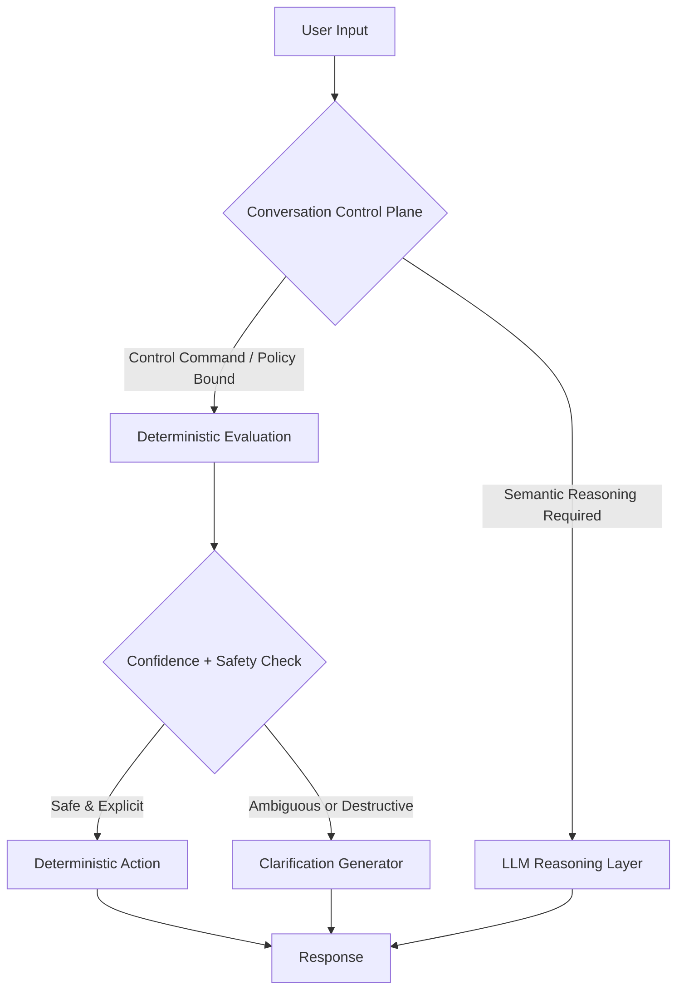

# HNIR-CCP: A Conversation Control Plane

**HNIR-CCP: Separating Conversational Control, Policy Enforcement, and Reasoning in LLM Agents.**

### TL;DR

HNIR-CCP prevents LLM agents from guessing procedural actions by introducing a deterministic control plane that governs state transitions, policy enforcement, and workflow execution before LLM reasoning occurs. It is a **safety middleware layer** for LLM agent architectures.

---

### Original Contribution

HNIR-CCP introduces a novel architectural abstraction: a deterministic conversational control plane designed explicitly for modern LLM agent systems. This positions CCP as a new category of safety middleware, addressing critical reliability and governance challenges emerging in autonomous AI workflows and agentic AI systems. While existing LLM orchestration frameworks focus on chaining reasoning steps, they do not formalize a distinct layer for deterministic command execution and policy enforcement. CCP formalizes this separation, positioning it as a critical safety boundary that governs *how* and *when* an LLM's reasoning is translated into procedural action, particularly as AI systems evolve toward long-horizon autonomous and agentic decision workflows. The project's contribution is the architectural pattern itself, its reference implementation, and the experimental framework for evaluating its impact. This work contributes to advancing architectural design methodologies for governed AI agent systems.

### Core Thesis: Separating Responsibilities

CCP proposes that conversational agent safety is achieved by separating three responsibilities:

1.  **Control:** Detection and execution of deterministic conversational commands and state transitions.
2.  **Policy Enforcement:** Authorization, compliance validation, workflow sequencing, and safety constraints.
3.  **Reasoning:** Open-ended natural language understanding and explanation delegated to LLMs.

### Design Philosophy

CCP assumes that:
*   Not all conversational inputs are semantic queries.
*   Some conversational requests represent procedural commands.
*   Safety-sensitive workflows require deterministic execution guarantees.

### Safety Invariants Enforced by CCP

CCP is designed to enforce the following invariants:

1.  Destructive or irreversible actions require explicit user confirmation.
2.  Policy-bound operations must pass all authorization and workflow validation steps.
3.  Conversational state transitions must be deterministic and auditable.
4.  LLM reasoning cannot bypass deterministic policy or control decisions.
5.  Ambiguous control commands must trigger structured clarification rather than execution.

### High-Level Architecture

The CCP operates as a governed control boundary between user input and LLM reasoning.

### Implementation Overview

The CCP reference implementation includes:

*   A deterministic command registry.
*   A policy enforcement pipeline.
*   A confidence and safety evaluation engine.
*   A deterministic action dispatcher.
*   An LLM fallback interface.
*   An observability and evaluation harness.

### Relationship to Existing LLM Agent Frameworks

CCP is designed to complement, not replace, existing LLM agent frameworks and orchestration models. It is fundamentally governance-oriented, emphasizing deterministic execution guarantees over reasoning chaining.

*   **Compared to Prompt Routing & Agent Chaining:** These frameworks excel at sequencing reasoning tasks. CCP operates a layer below, providing a deterministic governance backstop before a reasoning task is dispatched.
*   **Compared to Tool Invocation:** Tool-use pipelines focus on teaching an LLM *how* to call external functions. CCP focuses on *whether* an LLM should be allowed to make a call in the first place.

### How CCP Works: Concrete Examples

#### Example 1: Resume Conversation (High Confidence Control)

*   **User Input:** `resume our last conversation about access provisioning`
*   **CCP Behavior:** The CCP detects a `resume` command and executes a deterministic retrieval workflow *before* invoking the LLM, guaranteeing reliable session retrieval.
*   **CCP Response:** *“I found your recent session about access provisioning. Would you like to continue where you left off?”*

#### Example 2: Ambiguous Control Phrase (Safety Through Clarification)

*   **User Input:** `let’s start over`
*   **CCP Behavior:** The CCP detects a potential control verb, but because the command's scope is ambiguous and potentially destructive, it applies deterministic clarification instead of execution.
*   **CCP Response:** *“Do you want to reset this conversation, start a new topic, or clear stored preferences?”*

### CCP vs. LLM-Only Architectures

| Capability | LLM-Only | With CCP |
| :--- | :--- | :--- |
| **Deterministic State Transitions** | ❌ Unreliable | ✅ Enforced |
| **Policy Enforcement Guarantees** | ❌ Probabilistic | ✅ Guaranteed |
| **Auditability of Control Actions** | ❌ Limited | ✅ Strong |
| **Destructive Action Safety** | ❌ Unreliable | ✅ Enforced |
| **Semantic Reasoning** | ✅ | ✅ |

### Where CCP Provides Strongest Impact

CCP is particularly valuable in:

*   **Enterprise Identity and Access Management**
*   **Healthcare Clinical Decision Support**
*   **Financial Transaction and Fraud Prevention Systems**
*   **Compliance-Driven Automation Workflows**

### Intended Field Impact

This project aims to contribute to emerging research and engineering practices around the responsible deployment of safe and governed agentic AI systems. Specifically, CCP aims to support the safer deployment of agentic automation systems operating in regulated and safety-sensitive environments. By providing a reference architecture and an experimental platform, it supports the exploration of reliability in conversational AI, while supporting collaborative exploration across industry and academic research communities. The findings and patterns developed here are intended to be particularly relevant to the design of LLM-powered automation where deterministic behavior is not just preferred but often required.

By formalizing deterministic conversational control as a safety architecture, CCP contributes to the advancement of design patterns for governed AI agent systems. The architecture is intended to support cross-domain applications, including enterprise automation, safety-critical decision support, and regulated AI workflows, while enabling future research and derivative implementations exploring reliable agentic AI behavior. Collectively, CCP advances the emerging field of safe and governed agentic AI by introducing deterministic conversational control as a formal architectural design paradigm.

### Measuring CCP's Effectiveness

The value of the CCP architecture is evaluated using reproducible benchmarking workflows contained within this repository. The evaluation harness and benchmarking datasets are designed to be publicly reproducible to support community validation and comparative research, to empirically validate safety and reliability claims associated with deterministic conversational control. The evaluation harness is designed to run against standardized evaluation datasets (covering both clean and ambiguous inputs) to measure the following:

*   **Deterministic Diversion Rate:** The percentage of requests handled without LLM inference.
*   **Latency Reduction:** The decrease in response time for control operations compared to an LLM-only baseline.
*   **Retry and Clarification Frequency:** The rate at which users must rephrase commands or answer clarifying questions.
*   **Policy Enforcement Correctness:** The success rate of applying security and workflow policies.
*   **False-Positive Rate:** The frequency of incorrect control rule detection.

The repository is positioned as an experimental research platform to validate these metrics and explore the trade-offs between deterministic control and probabilistic reasoning.

### When CCP Is NOT the Right Tool

CCP is not intended for:

*   General knowledge Q&A systems.
*   Creative writing or ideation assistants.
*   Low-risk conversational workflows without state.
*   Systems where probabilistic reasoning is sufficient and procedural correctness is not critical.

### Scholarly Continuity

This project extends prior research into hybrid neuro-symbolic systems. HNIR-CCP evolves the original Hybrid Neuro-Symbolic Intent Router (HNIR) concept, which focused on efficient, deterministic routing for task-oriented bots. This work elevates that concept from an optimization for intent routing into a formal safety and governance architecture for modern, generative LLM agents. This repository provides reproducible open artifacts designed to support and enable future peer-reviewed scholarship and experimental work. The repository serves as a durable artifact that supports an ongoing research trajectory and future scholarly publications exploring the boundary between deterministic control and probabilistic reasoning in agentic systems.

### Roadmap

The high-level roadmap for this project is divided into several phases, from initial repository setup to a full evaluation harness and paper publication. See [ROADMAP.md](ROADMAP.md) for details.

### Author and Research Attribution
- **Aravind Ravi**
- **Personal Research Site:** https://www.raviaravind.com/
- **Research Lab:** https://www.teknamin.com/
- **Personal Research GitHub:** https://github.com/aravindravi-research
- **Lab Organization GitHub:** https://github.com/Teknamin
- **Contact:** aravind@raviaravind.com

### Development Methodology

This project uses AI-assisted development tooling (Claude Code) as part of its engineering workflow. All architectural decisions, design direction, and research contributions are by the author. AI tooling is used to accelerate implementation, documentation, and code generation under direct human supervision and review.

### License

This project is licensed under the Apache License 2.0. See the [LICENSE](LICENSE) file for details.
